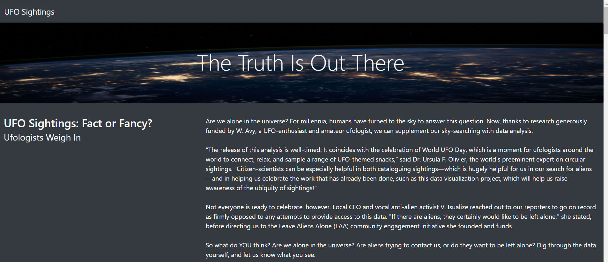
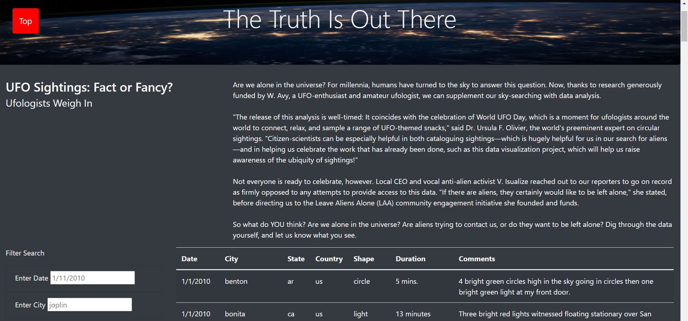

# UFOs  

## Overview of Project  

**Purpose:**  
The purpose of this project is to create a dynamic webpage with javascript, html, css, and bootstrap to filter through a dataset of UFO sightings based on the filters applied by user input.  

## Resources:  
- Data Source: Provided [Data](https://github.com/tonywang3571/UFOs/blob/master/static/js/data.js), [Image](https://github.com/tonywang3571/UFOs/blob/master/static/images/nasa.jpg)
- Software: VS code 1.63.2 (Javascript, HTML, CSS, Bootstrap)

## Analysis and Results  

**Analysis:**  
For this project, we first used javascript code to parse the dataset (which is also in javascript) to load and display the data in a table format. Next, we created a function to "remember" the filters that were added by the user within our webpage. Within our filter function, we added another function to pull and display data from our dataset that matches those filters that were added by the user. We also created an html file to display all of our data as well as different textboxes to allow user to add filters to filter through our dataset to display those data that matches those filters. As well as adding in bootstrap and CSS to improve the visualization of our webpage.

**Results:**  
When someone were to visit our webpage, the user can add specific filters to different textboxes on our webpage. After the user adds filters to their choosing, the user needs to either press "enter"/"return" or tab to remove the cursor from the current textbox in order for the data table to change automatically to filter our data to display our current data that matches the user's added filters. Reffering to the images below, we can see that our webpage is a working webpage with the example of the user entering "1/13/2010" for the new filter date, thus changing the data table to display only the newly filtered date provided by the user. Placeholders have been added to provide examples of how the user should enter specific information for the filters on our webpage.  
  
  

## Challenge Summary  

**Summary**  
The purpose of this project is to create a dynamic webpage to filter through our data set based on the user input to display only the data that meets the criteria of the filters. Though this webpage is functional, but there are still some shortcomings and areas where there can be improvement.  

- One shortcoming of this webpage is the data itself. With this particular webpage, we do not have a way or function to add new data as more UFO sightings appear and get reported. Updating our data file would allow the webpage to have more datasets to view and filter through.  

- One recommendation to improve our webpage would be to modify our filter textboxes to take both upper and lower case letters, as our data table lists all data in lower case (even city and state names as examples), therefore we could edit our code to allow the filters to take both upper and lower case letters in our filters textboxes to filter through our dataset to display the correct or appropriate data in our table. (I was able to modify my code to include this modification, refer to image below as an example)  
  

- Another recommendation to improve our webpage would be to add a "Go to top" feature. This way, if whenever our dataset gets larger, the user can click a button instead of scrolling all the way back to the top. (I was able to modify my code to include this feature where the "Go to top" button would appear if the user scrolls beyond a certain point, refer to image below as an example)  

  

### Codes Used  
(Please look at specific files for codes used)   
Code for [building data table and filters](https://github.com/tonywang3571/UFOs/blob/master/static/js/app.js)  
Code for [building webpage](https://github.com/tonywang3571/UFOs/blob/master/index.html)  
Code for [styling webpage](https://github.com/tonywang3571/UFOs/blob/master/static/css/style.css)

