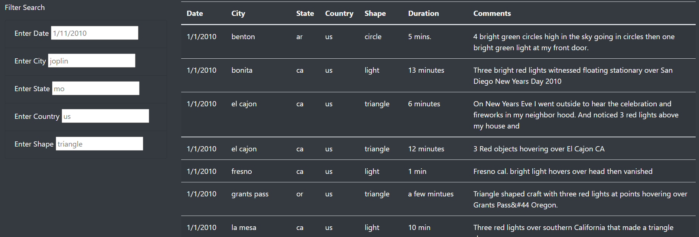

# UFOs  

## Overview of Project  

**Purpose:**  
The purpose of this project is to create a dynamic webpage with javascript, html, css, and bootstrap to filter through a dataset of UFO sightings based on the filters applied by user input.  

## Resources:  
- Data Source: Provided [Data](https://github.com/tonywang3571/UFOs/blob/master/static/js/data.js), [Image](https://github.com/tonywang3571/UFOs/blob/master/static/images/nasa.jpg)
- Software: VS code 1.63.2 (Javascript, HTML, CSS, Bootstrap)

## Analysis and Results  

**Analysis:**  
For this project, we first used javascript code to parse the dataset (which is also in javascript) to load and display the data in a table format. Next, we created a function to "remember" the filters that were added by the user within our webpage. Within our filter function, we added another function to pull and display data from our dataset that matches those filters that were added by the user. We also created an html file to display all of our data as well as different textboxes to allow user to add filters to filter through our dataset to display those data that matches those filters. As well as adding in bootstrap and CSS to improve the visualization of our webpage.

**Results:**  
ZZZZZ
  
  

## Challenge Summary  

**Summary**  
The purpose of this project is to create a dynamic webpage to filter through our data set based on the user input to display only the data that meets the criteria of the filters.  

ZZZZZ  

### Codes Used  
(Please look at specific files for codes used)   
Code for [building data table and filters](https://github.com/tonywang3571/UFOs/blob/master/static/js/app.js)  
Code for [building webpage](https://github.com/tonywang3571/UFOs/blob/master/index.html)  
Code for [styling webpage](https://github.com/tonywang3571/UFOs/blob/master/static/css/style.css)

